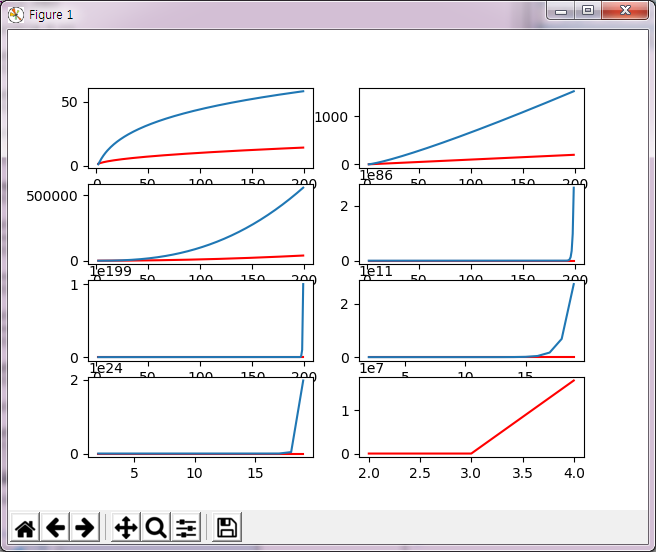
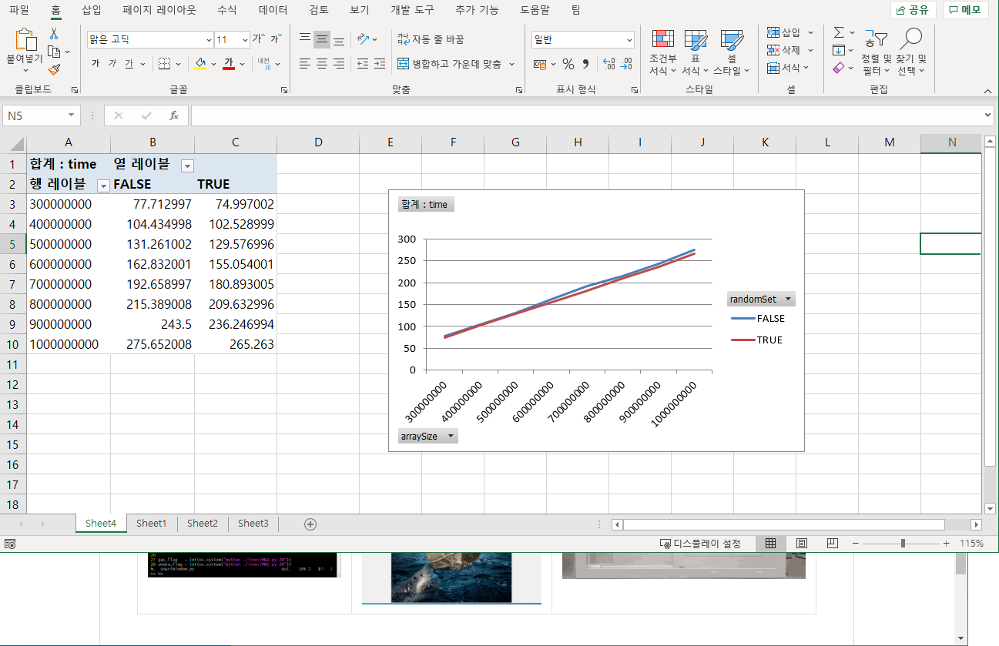
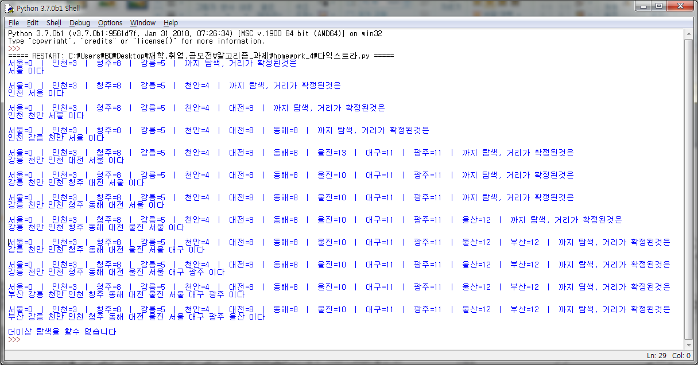

algorithm
=======
> 기본적인 알고리즘의 개요, 분할정복, 동적계획, 그리드 알고리즘등을 학습하였습니다.
## 1. 빅오표기법, 시간&공간 복잡도
* #### 알고리즘의 성능을 비교하기 위한 방법에 대한 학습을 하였습니다. 현재 대중화 되어 있는 컴퓨터의 구조는 멀티코어 시스템이 대다수이므로 성능 차이가 있을 수 있습니다.
## 2. 분할 정복법
* #### 큰 문제를 작게 나누어 알고리즘을 해결하는 방법으로, 대표적으로 퀵소트, 합병정렬 등이 있습니다. 이 때 함수를 재귀적으로 호출하는 방식과 퀵소트의 최악의 상황을 해결하기 위한 방법을 중점적으로 연구하였습니다.
## 3. 동적 계획법
* #### 공통적으로 연산되는 값을 저장하여 연산을 최소화하고 값을 구하는 문제해결 패러다임입니다. TSP등의 알고리즘의 문제풀이를 위해 사용하였습니다. 알고리즘의 특성상 별도의 저장소가 필요하였고, 문제를 풀기위한 자료구조등을 생각하여 풀이했습니다.
## 4. 그리드 알고리즘
* #### 프림, 크루스컬, 다익스트라 알고리즘을 이용하여 그래프의 최단거리 문제를 풀이하였습니다. 이외에 머신러닝의 경사하강법등 그리디한 문제를 해결하는데 도움이 되었습니다.
## 5. etc
* #### back tracking(되추적) 알고리즘이나 수학적 지식(vector,matrix)를 이용한 계산등을 학습하였습니다. 되추적 알고리즘의 경우 4Queen, TSP에 적용해보았고, 가우스 소거법, 내적과 외적을 이용한 거리, 넓이의 계산방법을 습득하였습니다.
| 복잡도 측정 | 퀵소트 측정 | 다익스트라 알고리즘 |
|---|---|---|
|  |  |  |

[//]: #

