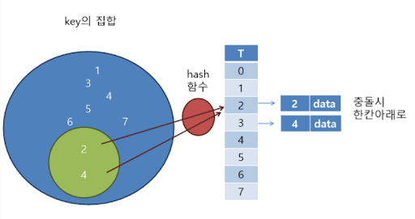

data structure
=======
> 구조의 기본적인 방법등을 학습하였습니다. 연결리스트, 배열, 스택, 큐, 트리등 기본적 알고리즘과 정렬, 탐색의 기본적 알고리즘에 대해 학습하였습니다.
## 연결리스트, 배열, 스택, 큐, 트리, 그래프
* #### 가장 기본적인 구성요소로 연결리스트와 배열 두가지 방법으로 코드를 만들었습니다.
## 정렬, 허프만 코드, 탐색트리&순회, 해싱
* #### 버블,삽입,선택,셸,퀵,플래그등의 정렬 방법과, 파일등을 압축하기 위한 허프만 코드, 탐색의 속도를 빠르게 하기 위한 탐색트리와 순회방식, 암호화와 빠른 탐색을 위한 해싱 알고리즘 등을 익혔습니다. 
| 정렬 |
|---|
|  |  
  
| 이진트리 | 해싱&해쉬 테이블 |
|---|---|
|  |  |

[//]: #

