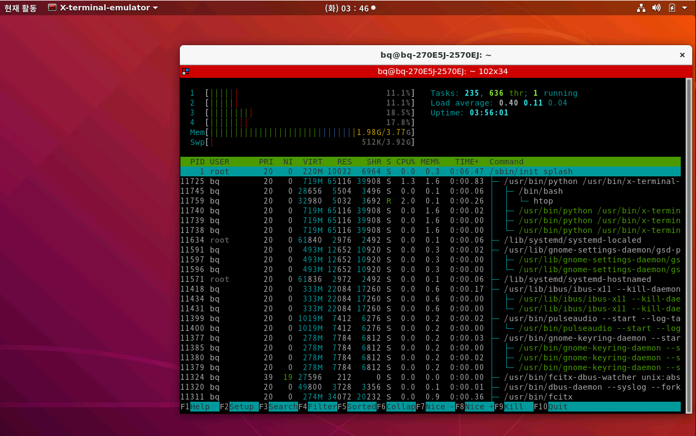
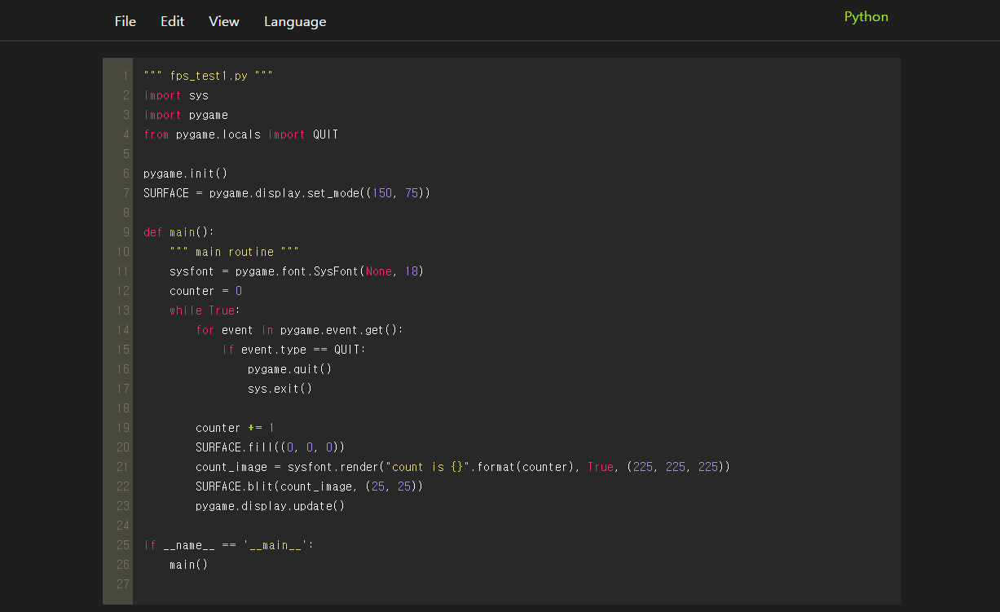

linux
=======
> linux 환경으로 ubuntu, raspbian을 사용하고 있습니다. 
# ubuntu
## 1. [vim] + jupyter notebook
* #### 간단한 소규모 프로젝트나 linux환경에서는 가급적이면 vim을 이용하고 있습니다. 기본적인 .vimrc의 세팅은 해당 디렉토리에 첨부합니다. python의 경우에는 jupyter notebook에서도 개발을 진행하고 있습니다.
## 2. server
* #### 간단한 socket programming 개발이 가능합니다.(c-lang, python) 주요 네트워크 서비스로 ssh/scp, ftp, homepage(apache) server를 이용하고 있습니다.
## 3. docker
* #### image file을 만들어 별도의 환경을 구축하여야 할 때 사용하고 있습니다.
# raspbian
## [IoT]
* #### raspberry pi(raspbian)환경에서 python 이용하여 주로 개발하였습니다. 

| ubuntu | IoT | jupyter notebook |
|---|---|---|
|  |  |  |

[//]: #
[IoT]: </language/python/>
[vim]: <../vim/>
