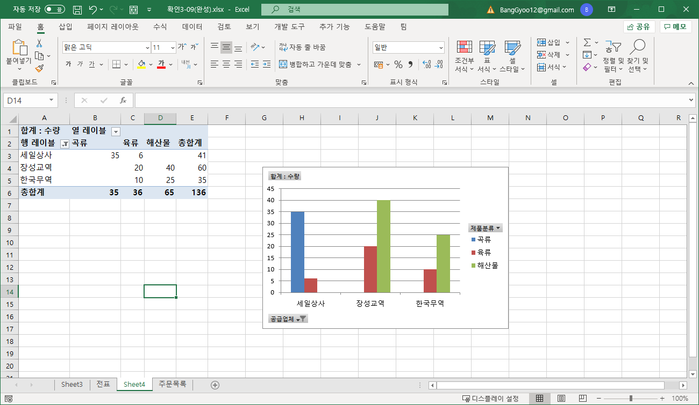
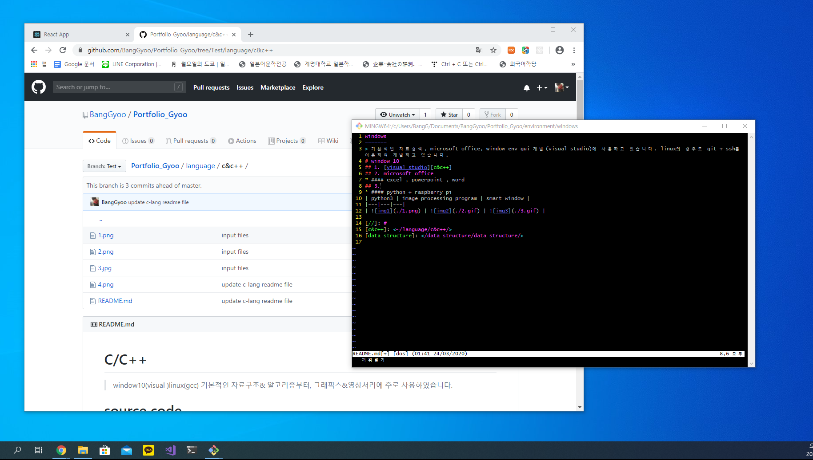

windows
=======
> 기본적인 자료검색, microsoft office, window env gui 개발(visual studio)에 사용하고 있습니다. 간단한 linux 프로젝트일 경우 git + ssh + vim를 이용하여 개발하고 있습니다.
# window 10
## 1. [visual studio][c&c++]
## 2. microsoft office
* #### excel , powerpoint , word 프로그램을 다룰수 있습니다.
## 3. [git] + vim 
* #### 소규모 프로젝트일 경우 vim을 이용하고 있습니다. 버전관리는 git으로 github 저장소를 이용합니다.
## 4. server
* #### cli 환경에서는 ssh, gui 환경에서는 remote desktop를 사용하고 있습니다. 내부 네트워크에서는  공유폴더를 사용합니다.
| visual studio | microsoft office | git + vim |
|---|---|---|
|  |  |  |

[//]: #
[c&c++]: </language/c&c++/>
[git]: </environment/git/>
