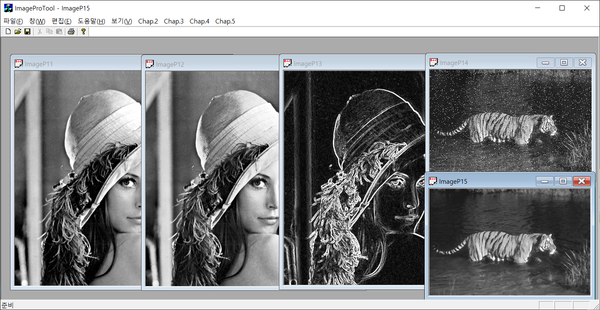
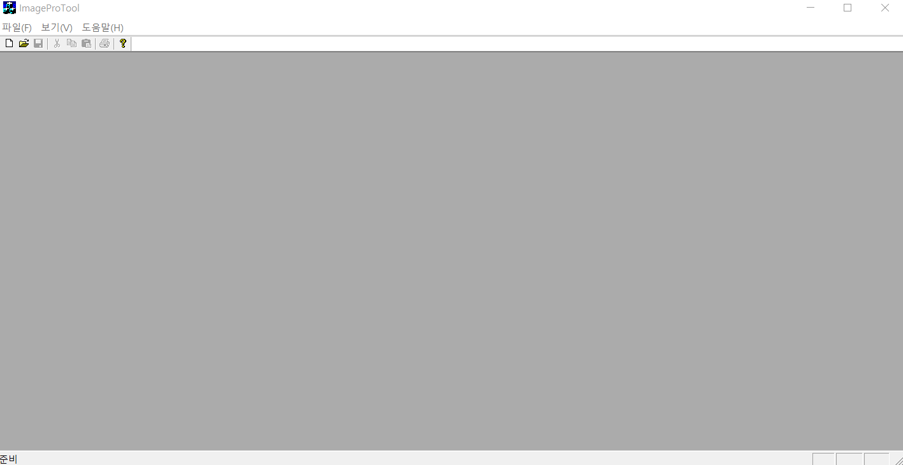

[image processing](https://github.com/BangGyoo/ImageProTool_Gyoo "소스코드참고")
=======
> 영상처리의 기본적인 필터링과 히스토그램, 특징 추출등을 학습하였습니다.
## 1. 영상 표현
* #### RGB 데이터의 분석, mean,gaussian,median등의 필터에 대해 적용하고, 각 필터의 차이와 필요를 학습하였습니다. 영상의 변형과 histogram stretching과 equalization등을 직접 구현해 보았습니다.

## 2. 특징 추출,군집화, 패턴분류
* #### 히스토그램 기반 특징,최대 확률, 엔트로피, 불변 모멘트 등을 통하여 특징을 추출한 후, 이를 k-mean 군집화를 이용하여 나누어보았습니다. 이를 이용하여 패턴을 분류하였습니다.
| 필터 적용 | 시연 영상 |
|---|---|
|  |  |

[//]: #

