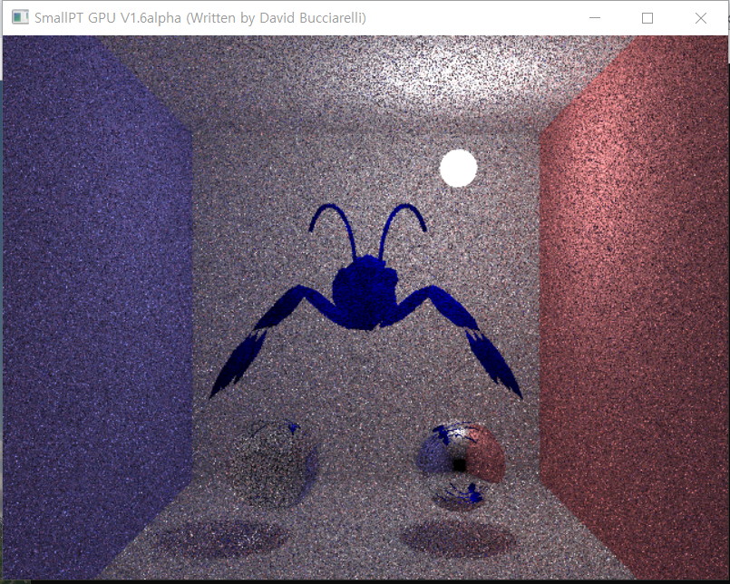
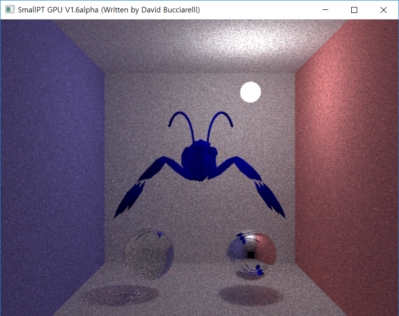

lab research
=======
> 그래픽스 연구를 진행하였습니다. path tracing의 속도 개선에 대한 연구를 진행하였습니다.
## 1. ray tracing/path tracing
* #### ray tracing은 광원에서부터 카메라로의 빛의 경로를 계산하는 알고리즘입니다. 이는 정반사(주광선)만 받아 처리하므로 실제와 다른 이질감을 느낄수 있습니다.
* #### 이를 개선하기 위하여 정반사와 난반사(질감,그림자 등)를 표현하기 위한 알고리즘으로 path tracing이 대두되었습니다. 다만 난반사는 무수히 많은 입자가 튀기는 것을 표현하지 못하기 때문에 이를 표현하기 위하여 random walk를 이용하여 표현 되었습니다.

## 2. 속도개선
* #### 패스 트래이싱의 특성상 만족스러운 품질에 도달하기 위한 연산시간이 길어 속도개선에 대한 연구를 진행하였습니다. 경계 상자와 BVH(바운딩 볼륨 체계), image filter, GPGPU등의 개선 여부등을 조사하였습니다. 

## 3. 논문
* #### [Comparison and Analysis of Noise Filtering Algorithms for path Tracing](http://www.irphouse.com/ijert19/ijertv12n6_08.pdf)
| BRDF/BTDF | path tracing 5회 | path tracing 20회|
|---|---|---|
|  |  |  |

[//]: #

