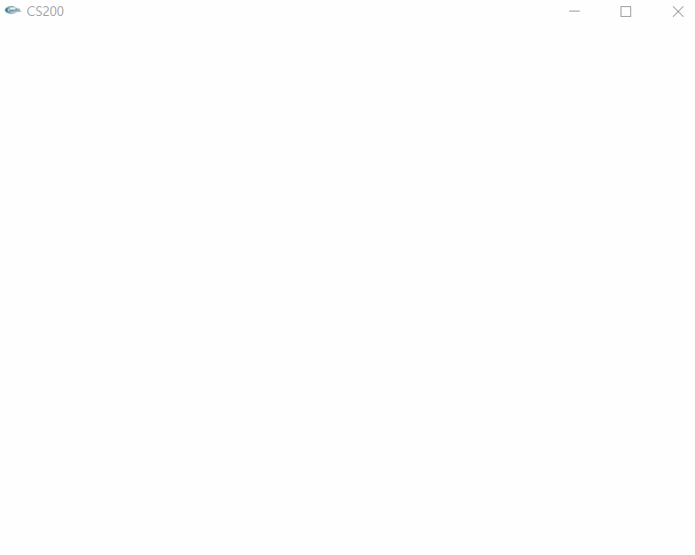
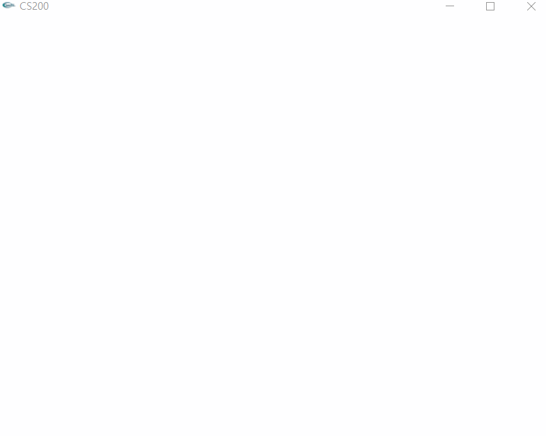
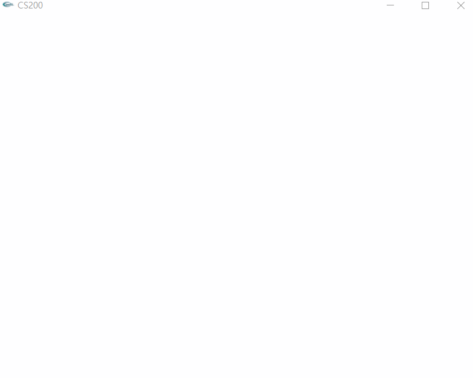
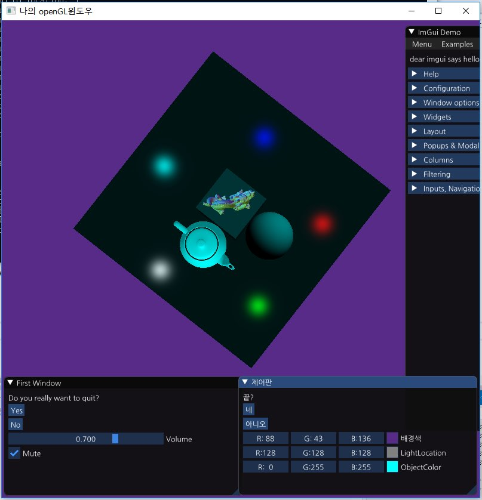
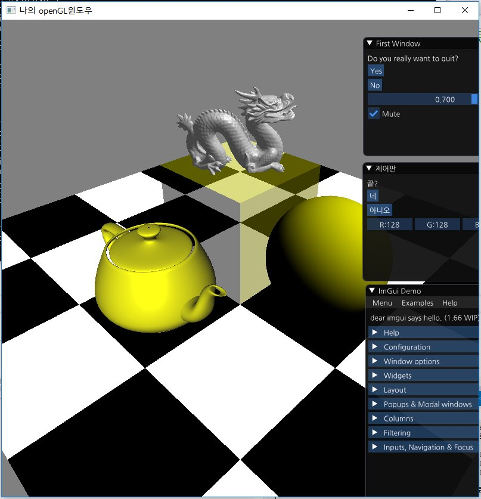
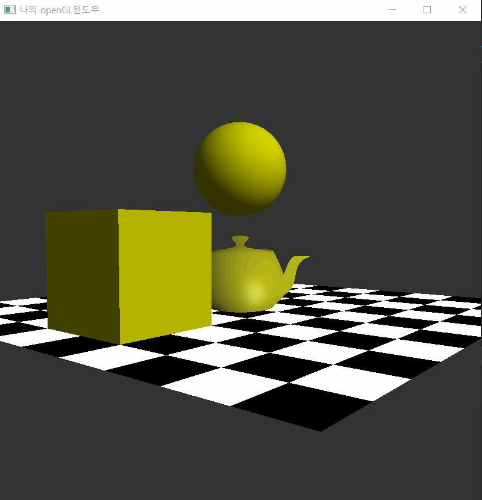

open gl
=======
> Open GL을 이용하여 그래픽스의 기본적인 벡터 연산, 파이프라인/쉐이더에 대하여 학습하였습니다. 
# pipelining,shader
* #### 그래픽스 프로그램 중 대중화 되어있는 파이프라이닝을 적용하였습니다. 버텍스 -> 지오메트리 -> 뷰포트 좌표계 -> 래스터라이징 기본적인 그래픽스 프로그래밍 방식을 터득하였습니다.  
* #### 색,명암, 질감등을 표현하기 위해 쉐이더를 적용하였습니다. GLSL을 이용하여, 버텍스,지오메트리, 프레그먼트 쉐이더를 다루었고, 이를 기반으로 퐁모델, 퐁쉐이더를 만들었습니다.
## 1. [2d graphic][2d]
* #### glut를 이용하여 제작하였습니다. 직선,곡선방정식을 시작으로 원, 타원, 폴리곤등의 표현을 직접 코딩,학습하였습니다.
| 선 찍기 | 원 그리기 | 삼각형 그리기(Counterclockwise) |
|---|---|---|
|  |  |  |

## 2. [3d graphic][3d]
* #### GLSL을 사용하여 프로그래밍 하였습니다.  모델은 assimp library로 불러와 사용하였습니다.
| gui programming | phong model | applied light |
|---|---|---|
|  |  |  |

[//]: #
[2d]: <https://github.com/BangGyoo/graphics2d>
[3d]: <https://github.com/BangGyoo/Realtime_rendering.git>
