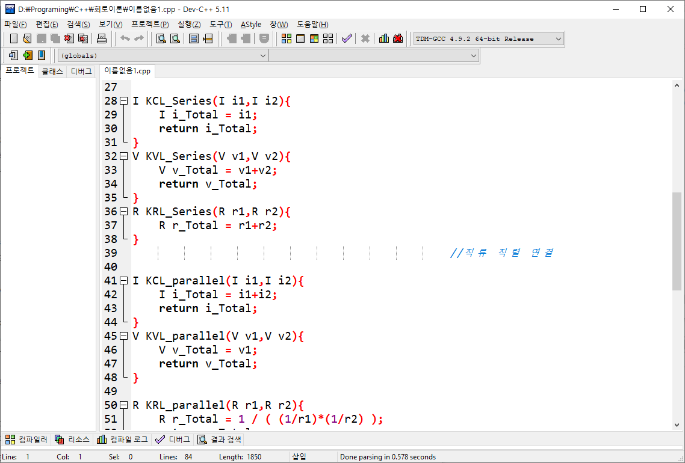
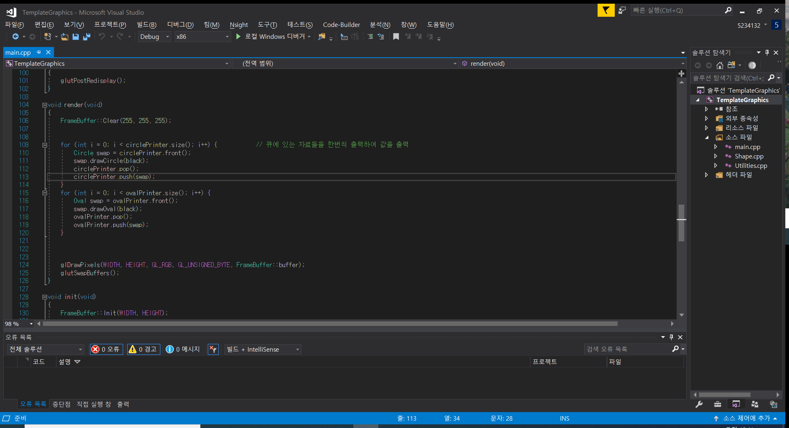
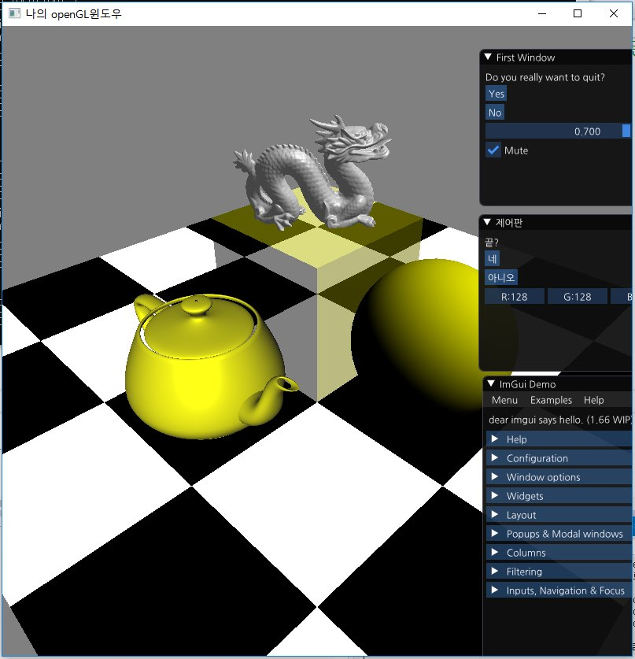
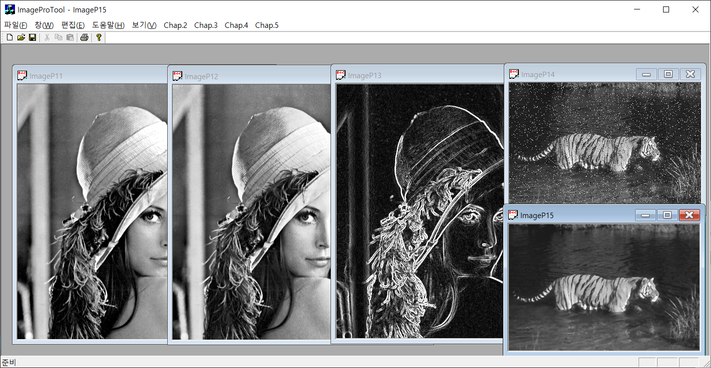

C/C++
=======
> window10(visual )linux(gcc) 기본적인 자료구조& 알고리즘부터, 그래픽스&영상처리에 주로 사용하였습니다.
# source code
## 1. data structure & algorithm
* #### data structure
* #### algorithm
## 2. graphics
* #### open gl
* #### image processing
| dev c/c++ | visual studio | graphics | image processing |
|---|---|---|---|
|  |  |  |  |

[//]: #
[data structure]: </data structure/data structure/>
[algorithm]: </data structure/algorithm/>
[open gl]: </graphics/open gl/>
[image processing]: </graphics/image processing>

