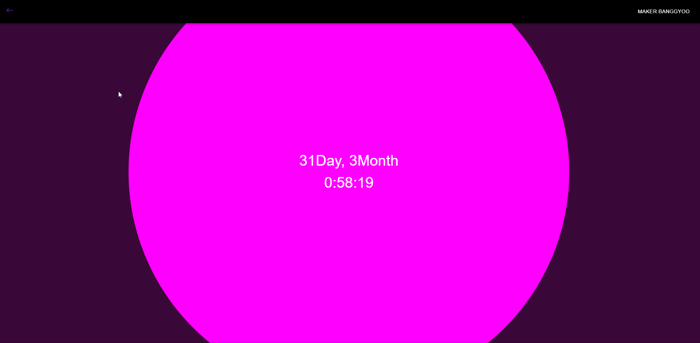
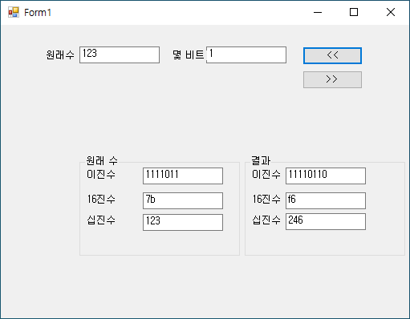
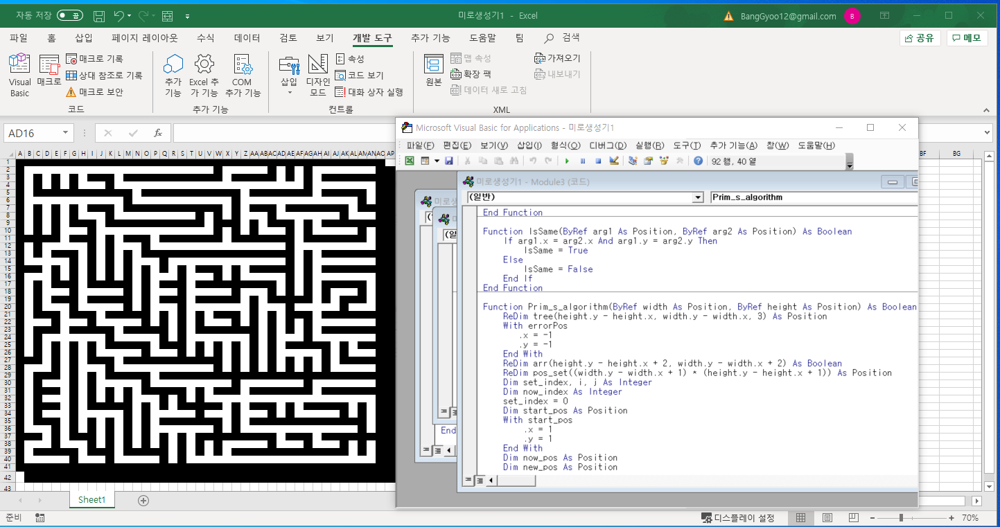
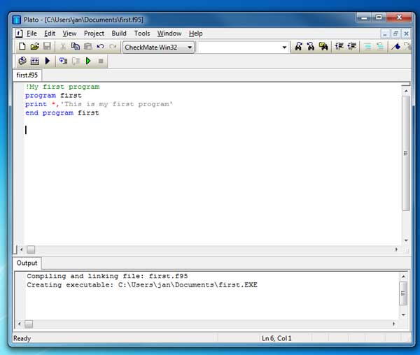

etc..
=======
> 수업, 토이프로젝트로 제작한 코딩입니다. html, css, java script(react), java(swing), VBA(EXCEL), C#(GUI), FORTRAN등을 활용하였습니다.
# source code
## 1. web project
* #### my introduce
* #### css practice
## 2. c# project
* #### c# 수업
## 3. FORTRAN project
* #### FORTRAN 수업
## 4. etc
* #### java swing practice
* #### VBA 미로생성기(Prim algorithm)
| homepage | c# project | 미로생성기 | fortran95 |
|---|---|---|---|
|  |  |  |  |

[//]: #
[data structure]: </data structure/data structure/>

