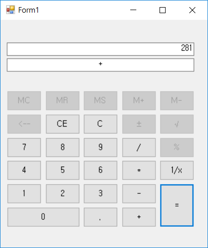
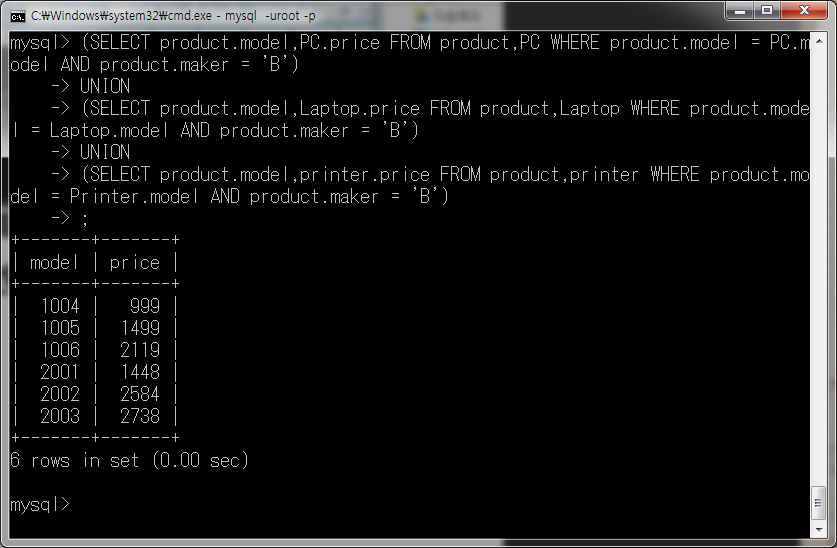
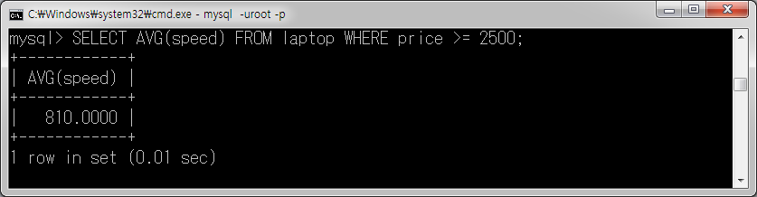

etc..
=======
> 수업, 토이프로젝트로 제작한 코딩입니다. html, css, java script(react), java(swing), VBA(EXCEL), C#(GUI), FORTRAN등을 활용하였습니다.

| homepage | 미로생성기 | fortran95 |
|---|---|---|
|  |  |  |   
   
| c# project 1 | c# project 2 | MySQL 1 | MySQL 2 |
|---|---|---|---|
|  |  |  |  |

# source code
## 1. web project
* #### [react proj][react]
* #### [css practice][css]
## 2. c# project
* #### [c# 수업][cs]
## 3. FORTRAN project
* #### [FORTRAN 수업][fortran]
## 4. etc
* #### java swing practice
* #### VBA 미로생성기(Prim algorithm)
* #### 데이터베이스(mySQL) [result][database]

[//]: #
[react]: <https://github.com/BangGyoo/react_proj>
[cs]: <https://github.com/BangGyoo/class_CS>
[fortran]: <./Fortran95/>
[database]: <./database/>
[css]: <https://github.com/BangGyoo/study_css>
