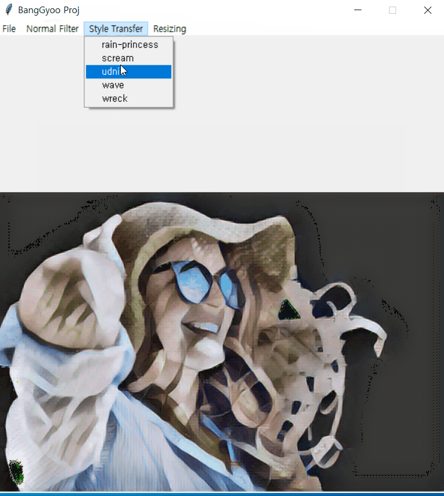

python
=======
> python3(vim,pdb,venv), OpenCV, matplotlib, tkinter등으로 gui, 영상처리, 그래프분석, IOT 스마트 윈도우에 사용하였습니다.
# source code
## 1. [image processing program][Edit_Picture]
* #### open cv + tkinter + tensorflow
## 2. [smart window][smartWindow]
* #### python + raspberry pi
| python3 | smart window |
|---|---|
|  |  |   
   
| style transfer1 | style transfer2 | image processing program |
|---|---|---|
|  |  |  |

[//]: #
[data structure]: </data structure/data structure/>
[Edit_Picture]: <https://github.com/BangGyoo/Edit_Picture>
[smartWindow]: <https://github.com/BangGyoo/smartWindow>
